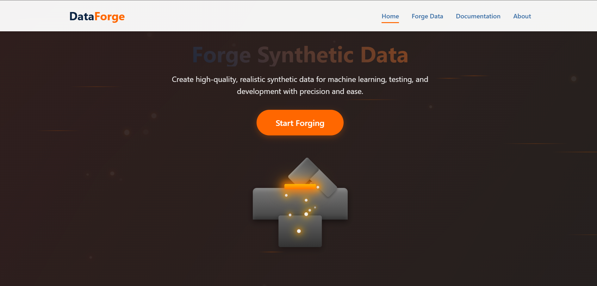

# DataForge - Synthetic Data Generator



A comprehensive Python solution for generating various types of synthetic data for machine learning, testing, and development purposes. DataForge includes both a powerful Python library and a user-friendly web application.

## Web Application

DataForge provides an intuitive web interface for generating synthetic data without writing code:

- **Multiple Data Types**: Generate tabular, image, text, timeseries, and audio data
- **Customizable Parameters**: Fine-tune your synthetic data with extensive configuration options
- **Immediate Feedback**: See previews of generated data before downloading
- **Easy Downloads**: Download generated data in various formats (CSV, JSON, Excel, PNG, etc.)
- **Clean Organization**: All generated files are properly named and formatted

### Running the Web App

```bash
# Install requirements
pip install -r requirements.txt

# Start the Flask application
python run_flask.py --debug
```

Then visit http://127.0.0.1:5000/ in your browser to access the DataForge interface.

## Python Library

The core functionality is also available as a Python library for integration into your projects:

### Features

- **Tabular Data Generation**: Create structured datasets with customizable schemas, distributions, and correlations
- **Image Data Generation**: Generate synthetic images with various patterns, shapes, and transformations
- **Text Data Generation**: Create text data with customizable content, length, and linguistic properties
- **Time Series Data Generation**: Generate time series data with trends, seasonality, and noise
- **Audio Data Generation**: Create synthetic audio signals with customizable properties

### Usage

#### Basic Example

```python
from synthetic_data_generator.data_types import tabular_data
from synthetic_data_generator.utils import exporters

# Generate a synthetic tabular dataset
data = tabular_data.generate_dataset(
    rows=1000,
    schema={
        'age': {'type': 'int', 'min': 18, 'max': 90},
        'income': {'type': 'float', 'min': 20000, 'max': 200000, 'distribution': 'normal'},
        'gender': {'type': 'category', 'categories': ['M', 'F', 'Other']},
        'name': {'type': 'name'},
        'email': {'type': 'email'}
    }
)

# Export to CSV
exporters.to_csv(data, 'synthetic_data.csv')
```

Check the `examples` directory for more detailed usage examples for each data type.

## Configuration

You can customize the behavior of the data generators using the configuration files in the `config` directory.

## Project Structure

```
synthetic_data_generator/
├── app.py                # Flask web application
├── data_generator.py     # Core data generation class
├── config/               # Configuration files for data generation
├── static/               # Web app static files 
│   ├── css/              # Stylesheets
│   ├── js/               # JavaScript files
│   └── images/           # Image assets
├── templates/            # HTML templates
├── data_types/           # Core data generation modules
│   ├── tabular_data.py   # Tabular data generation
│   ├── image_data.py     # Image data generation
│   ├── text_data.py      # Text data generation
│   ├── time_series_data.py # Time series data generation
│   └── audio_data.py     # Audio data generation
├── examples/             # Example scripts for each data type
├── utils/                # Utility functions
└── output/               # Default directory for generated outputs
```

## Detailed Examples

### Tabular Data

```python
from synthetic_data_generator.data_types import tabular_data

# Generate a dataset with correlations
data = tabular_data.generate_dataset(
    rows=1000,
    schema={
        'age': {'type': 'int', 'min': 18, 'max': 90},
        'income': {'type': 'float', 'min': 20000, 'max': 200000},
        'education_years': {'type': 'int', 'min': 8, 'max': 22}
    },
    correlations={
        'age': {'income': 0.6, 'education_years': 0.4},
        'education_years': {'income': 0.7}
    }
)
```

### Image Data

```python
from synthetic_data_generator.data_types import image_data
from synthetic_data_generator.utils import exporters

# Generate a noise image
img = image_data.generate_noise_image(width=256, height=256, noise_type='gaussian')
exporters.save_image(img, 'noise_image.png')

# Generate an image dataset
dataset = image_data.generate_image_dataset(
    num_images=10,
    width=64,
    height=64,
    image_type='pattern'
)
```

### Time Series Data

```python
from synthetic_data_generator.data_types import time_series_data

# Generate a time series with trend, seasonality and noise
time_index, ts = time_series_data.generate_time_series(
    length=365,
    components=['trend', 'seasonality', 'noise'],
    trend_type='linear',
    seasonality_period=30,
    noise_level=0.5
)
```

## Requirements

- Python 3.7+
- Flask
- NumPy
- Pandas
- Pillow
- Matplotlib
- Faker
- SciPy
- Librosa (for audio)
- Transformers (for text)

## License

MIT License

## Contributing

Contributions are welcome! Please feel free to submit a Pull Request.

1. Fork the repository
2. Create your feature branch (`git checkout -b feature/amazing-feature`)
3. Commit your changes (`git commit -m 'Add some amazing feature'`)
4. Push to the branch (`git push origin feature/amazing-feature`)
5. Open a Pull Request

## Acknowledgments

- Inspired by the need for high-quality synthetic data in machine learning and testing
- Thanks to all contributors who have helped shape this project
